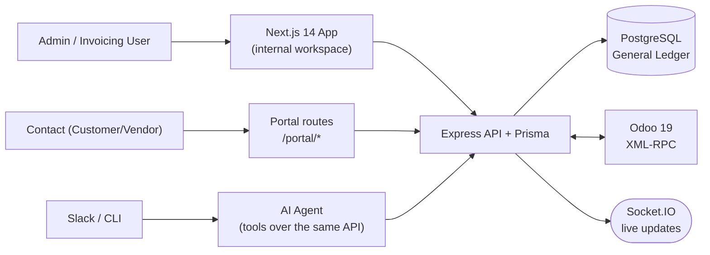

# Urban Furniture — Accounting System: End-to-End Build Plan

> Companion to [IDEAS.md](IDEAS.md). That file is *how to win*; this file is *what to build*.
>
> **Sources:** the Odoo problem statement PDF, the Excalidraw mockup (read as an image — see Assumptions), and the organizer must-haves in IDEAS.md §0.5.

---

## 0. Assumptions to verify against the live mockup (do this in H0)

The mockup was read from a downscaled render. Screen inventory, flows and layout are certain; some field-level text was not legible. **Open the Excalidraw board and confirm these 8 items in the first 30 minutes** — each one is cheap to fix now and expensive to fix at H18.

| # | Assumption | Where it came from | Risk if wrong |
|---|---|---|---|
| A1 | Journal Entry form blocks save when Σdebit ≠ Σcredit | Legible callout on the entry screen | None — this is correct accounting regardless |
| A2 | `Account` field = dropdown sourced from Chart of Accounts; `Partner` = dropdown from Contact Master | "Field Explanation" box | Low |
| A3 | Contact & Product masters each need **three** views: Form, List, Kanban/card | Three panels drawn per master | Medium — Kanban is ~1h each |
| A4 | Auth is Register / Login / Forgot-password (OTP or reset link) | Three panels at the top | Medium — OTP flow is a time sink; see §12 |
| A5 | Top nav = Sales, Purchase, Account, Report (4 menus) with a dropdown per menu | Dashboard panel + expanded dropdown panel | Low |
| A6 | Budget Report includes a **pie chart** and a start/end date range filter | Pie chart is clearly drawn | Low |
| A7 | PO → Vendor Bill → Bill Payment and SO → Customer Invoice → Invoice Payment are the two document chains | Arrow flows in "Data Input Form" | None — matches PDF §4 |
| A8 | Reports required: P&L + Balance Sheet (+ Budget Report) | Bottom two panels + PDF §6 | None |

Anything in the green/red annotation boxes that contradicts this plan **wins** — the mockup is the spec judges compare against.

---

## 1. The product in one sentence

A double-entry accounting system for a furniture business where **every financial document posts balanced journal entries into a real general ledger, and every report is derived from that ledger — never from the document tables.**

### The governing rule (this is the whole design)

> **A posted journal entry is immutable.** You cannot edit it. To change it you post a *reversing* entry.

This is genuine accounting behaviour, and it's the same structural move that won the last hackathon ("nothing can be edited directly"). It hands you, for free: an audit trail, a draft→post approval moment, version history, and a governance story.

### The three things that must be true at all times

1. **Every** `JournalEntry` satisfies `Σ debit == Σ credit`. Enforced in a DB transaction, rejected with 422 otherwise.
2. **Every** report is a `groupBy` over `JournalItem` joined to `ChartOfAccount.type`. Zero reports read the invoice table.
3. `Assets == Liabilities + Capital + (Income − Expense)`. Displayed live on the Balance Sheet as a green ✓.

If a judge asks "show me the journal entry behind this number", you can — from any screen, in one click.

---

## 2. Architecture



**Stack** (per IDEAS.md §1.3 — chosen for speed, not novelty):

| Layer | Choice |
|---|---|
| Frontend | Next.js 14 App Router, plain JS, Tailwind, lucide-react, Recharts (pie/bar) |
| Backend | Express 4 (ESM), Prisma 5, Zod, Socket.IO, helmet/cors/morgan/cookie-parser |
| DB | PostgreSQL 15, all money as `Decimal(14,2)` |
| Auth | bcrypt + JWT in httpOnly cookie + `requireRole` middleware |
| PDF | `pdfkit` or `@react-pdf/renderer` for invoice/bill PDFs |
| ERP | `xmlrpc` → Odoo 19 in Docker (latest stable — Odoo 20 isn't out until Odoo Experience 2026, ~Sept 24–26) |
| AI | Groq (OpenAI-compatible), `AI_BASE_URL` swappable to local Ollama |

**Ports:** frontend 3000, API 4000, Postgres 5432, Odoo 8069.

### ⚠️ Money rule — write this on the whiteboard

**Never use JavaScript floats for money.** `0.1 + 0.2 !== 0.3` will make your balance sheet fail to balance by ₹0.01 and you will lose an hour at 3am finding it.

- DB: `Decimal(14,2)`
- Backend: Prisma returns `Decimal` objects — do arithmetic with `.plus()/.minus()/.times()`, or convert to integer paise
- Rounding: round **once**, at the line-total level, half-up to 2dp. Never round intermediate tax math twice.
- Frontend: format for display only, never compute a total the backend didn't send

---

## 3. Complete data model

> ⚠️ **`backend/prisma/schema.prisma` is the canonical schema** — it is kept current and includes the inventory, valuation and multi-currency models added after this section was first drafted (`Currency`, `CurrencyRate`, `StockMove`, `StockValuationLayer`, plus currency/costing fields on documents and `JournalItem`). The block below is the narrative overview; when the two disagree, **the file wins.**

```prisma
generator client { provider = "prisma-client-js" }
datasource db { provider = "postgresql"; url = env("DATABASE_URL") }

// ───────────── enums ─────────────
enum Role         { admin invoicing_user contact }
enum Status       { active archived }
enum ContactType  { customer vendor both }
enum ProductType  { goods service combo }
enum AccountType  { asset liability income expense capital }
enum JournalType  { sales purchase bank cash miscellaneous }
enum EntryState   { draft posted cancelled }
enum DocState     { draft confirmed cancelled }        // PO / SO
enum MoveState    { draft posted cancelled }           // Bill / Invoice
enum SettleState  { not_paid partial paid }
enum PayDirection { inbound outbound }                 // receive / pay
enum AnalyticType { income expense }

// ───────────── identity ─────────────
model User {
  id        String   @id @default(uuid())
  name      String
  email     String   @unique
  password  String
  role      Role
  contactId String?  @unique @map("contact_id")        // set for portal users
  status    Status   @default(active)
  resetOtp        String?   @map("reset_otp")
  resetOtpExpires DateTime? @map("reset_otp_expires")
  createdAt DateTime @default(now()) @map("created_at")

  contact   Contact? @relation(fields: [contactId], references: [id])
  auditLogs AuditLog[] @relation("AuditPerformer")
  budgets   Budget[]   @relation("BudgetOwner")
  @@map("users")
}

// ───────────── master data ─────────────
model Contact {
  id           String      @id @default(uuid())
  name         String
  type         ContactType
  email        String?
  mobile       String?
  city         String?
  state        String?
  pincode      String?
  profileImage String?     @map("profile_image")
  status       Status      @default(active)
  createdAt    DateTime    @default(now()) @map("created_at")

  user            User?
  purchaseOrders  PurchaseOrder[]
  salesOrders     SalesOrder[]
  bills           VendorBill[]
  invoices        CustomerInvoice[]
  payments        Payment[]
  journalItems    JournalItem[]
  @@index([type, status])
  @@map("contacts")
}

model Product {
  id         String      @id @default(uuid())
  name       String
  type       ProductType
  category   String?
  salesPrice Decimal     @default(0) @map("sales_price") @db.Decimal(14,2)
  cost       Decimal     @default(0) @db.Decimal(14,2)
  taxId      String?     @map("tax_id")
  status     Status      @default(active)
  createdAt  DateTime    @default(now()) @map("created_at")

  tax        Tax?        @relation(fields: [taxId], references: [id])
  poLines    PurchaseOrderLine[]
  soLines    SalesOrderLine[]
  billLines  VendorBillLine[]
  invLines   CustomerInvoiceLine[]
  @@map("products")
}

model Tax {
  id       String  @id @default(uuid())
  name     String                                       // "GST 18%"
  rate     Decimal @db.Decimal(5,2)                     // 18.00
  status   Status  @default(active)
  products Product[]
  @@map("taxes")
}

model ChartOfAccount {
  id        String      @id @default(uuid())
  code      String      @unique                          // "1100" — drives report ordering
  name      String                                       // "Debtors"
  type      AccountType
  status    Status      @default(active)
  createdAt DateTime    @default(now()) @map("created_at")

  journalItems     JournalItem[]
  journalsAsDebit  Journal[] @relation("JournalDefaultDebit")
  journalsAsCredit Journal[] @relation("JournalDefaultCredit")
  @@index([type, code])
  @@map("chart_of_accounts")
}

model Journal {
  id              String      @id @default(uuid())
  name            String                                  // "Sales Journal"
  type            JournalType
  code            String      @unique                     // "INV", "BILL", "BNK", "CSH"
  defaultDebitId  String?     @map("default_debit_id")
  defaultCreditId String?     @map("default_credit_id")
  status          Status      @default(active)

  defaultDebit    ChartOfAccount? @relation("JournalDefaultDebit",  fields: [defaultDebitId],  references: [id])
  defaultCredit   ChartOfAccount? @relation("JournalDefaultCredit", fields: [defaultCreditId], references: [id])
  entries         JournalEntry[]
  payments        Payment[]
  @@map("journals")
}

// ───────────── THE LEDGER (source of truth) ─────────────
model JournalEntry {
  id         String     @id @default(uuid())
  number     String     @unique                          // "INV/2026/0001"
  journalId  String     @map("journal_id")
  date       DateTime                                     // accounting date
  reference  String?                                      // source doc number
  narration  String?
  state      EntryState @default(draft)
  postedAt   DateTime?  @map("posted_at")
  createdBy  String?    @map("created_by")
  reversalOfId String?  @unique @map("reversal_of_id")

  journal    Journal       @relation(fields: [journalId], references: [id])
  items      JournalItem[]
  reversalOf JournalEntry? @relation("Reversal", fields: [reversalOfId], references: [id])
  reversedBy JournalEntry? @relation("Reversal")
  bill       VendorBill?
  invoice    CustomerInvoice?
  payment    Payment?
  @@index([state, date])
  @@map("journal_entries")
}

model JournalItem {
  id                String  @id @default(uuid())
  entryId           String  @map("entry_id")
  accountId         String  @map("account_id")
  partnerId         String? @map("partner_id")
  analyticAccountId String? @map("analytic_account_id")
  label             String?
  debit             Decimal @default(0) @db.Decimal(14,2)
  credit            Decimal @default(0) @db.Decimal(14,2)

  entry           JournalEntry     @relation(fields: [entryId], references: [id], onDelete: Cascade)
  account         ChartOfAccount   @relation(fields: [accountId], references: [id])
  partner         Contact?         @relation(fields: [partnerId], references: [id])
  analyticAccount AnalyticAccount? @relation(fields: [analyticAccountId], references: [id])
  @@index([accountId])
  @@index([analyticAccountId])
  @@map("journal_items")
}

// ───────────── analytic + budget ─────────────
model AnalyticAccount {
  id     String       @id @default(uuid())
  name   String
  type   AnalyticType
  status Status       @default(active)

  budgets      Budget[]
  journalItems JournalItem[]
  @@map("analytic_accounts")
}

model Budget {
  id                String   @id @default(uuid())
  name              String
  analyticAccountId String   @map("analytic_account_id")
  startDate         DateTime @map("start_date")
  endDate           DateTime @map("end_date")
  plannedAmount     Decimal  @map("planned_amount") @db.Decimal(14,2)
  responsibleId     String?  @map("responsible_id")
  status            Status   @default(active)

  analyticAccount AnalyticAccount @relation(fields: [analyticAccountId], references: [id])
  responsible     User?           @relation("BudgetOwner", fields: [responsibleId], references: [id])
  @@map("budgets")
}

// ───────────── purchase chain ─────────────
model PurchaseOrder {
  id          String   @id @default(uuid())
  number      String   @unique                            // "PO/2026/0001"
  vendorId    String   @map("vendor_id")
  orderDate   DateTime @map("order_date")
  state       DocState @default(draft)
  untaxed     Decimal  @default(0) @db.Decimal(14,2)
  taxAmount   Decimal  @default(0) @map("tax_amount") @db.Decimal(14,2)
  total       Decimal  @default(0) @db.Decimal(14,2)
  createdBy   String?  @map("created_by")
  createdAt   DateTime @default(now()) @map("created_at")

  vendor Contact             @relation(fields: [vendorId], references: [id])
  lines  PurchaseOrderLine[]
  bills  VendorBill[]
  @@map("purchase_orders")
}

model PurchaseOrderLine {
  id        String  @id @default(uuid())
  orderId   String  @map("order_id")
  productId String  @map("product_id")
  quantity  Decimal @db.Decimal(14,3)
  unitPrice Decimal @map("unit_price") @db.Decimal(14,2)
  taxRate   Decimal @default(0) @map("tax_rate") @db.Decimal(5,2)
  subtotal  Decimal @db.Decimal(14,2)
  analyticAccountId String? @map("analytic_account_id")

  order   PurchaseOrder @relation(fields: [orderId], references: [id], onDelete: Cascade)
  product Product       @relation(fields: [productId], references: [id])
  @@map("purchase_order_lines")
}

model VendorBill {
  id             String      @id @default(uuid())
  number         String      @unique                      // "BILL/2026/0001"
  vendorId       String      @map("vendor_id")
  purchaseOrderId String?    @map("purchase_order_id")
  billDate       DateTime    @map("bill_date")
  dueDate        DateTime?   @map("due_date")
  state          MoveState   @default(draft)
  settleState    SettleState @default(not_paid) @map("settle_state")
  untaxed        Decimal     @default(0) @db.Decimal(14,2)
  taxAmount      Decimal     @default(0) @map("tax_amount") @db.Decimal(14,2)
  total          Decimal     @default(0) @db.Decimal(14,2)
  amountResidual Decimal     @default(0) @map("amount_residual") @db.Decimal(14,2)
  journalEntryId String?     @unique @map("journal_entry_id")
  createdBy      String?     @map("created_by")

  vendor        Contact          @relation(fields: [vendorId], references: [id])
  purchaseOrder PurchaseOrder?   @relation(fields: [purchaseOrderId], references: [id])
  journalEntry  JournalEntry?    @relation(fields: [journalEntryId], references: [id])
  lines         VendorBillLine[]
  allocations   PaymentAllocation[]
  @@map("vendor_bills")
}

model VendorBillLine {
  id        String  @id @default(uuid())
  billId    String  @map("bill_id")
  productId String  @map("product_id")
  accountId String  @map("account_id")                    // expense account hit
  quantity  Decimal @db.Decimal(14,3)
  unitPrice Decimal @map("unit_price") @db.Decimal(14,2)
  taxRate   Decimal @default(0) @map("tax_rate") @db.Decimal(5,2)
  subtotal  Decimal @db.Decimal(14,2)
  analyticAccountId String? @map("analytic_account_id")

  bill    VendorBill @relation(fields: [billId], references: [id], onDelete: Cascade)
  product Product    @relation(fields: [productId], references: [id])
  @@map("vendor_bill_lines")
}

// ───────────── sales chain (mirrors purchase) ─────────────
model SalesOrder {
  id        String   @id @default(uuid())
  number    String   @unique                              // "SO/2026/0001"
  customerId String  @map("customer_id")
  orderDate DateTime @map("order_date")
  state     DocState @default(draft)
  untaxed   Decimal  @default(0) @db.Decimal(14,2)
  taxAmount Decimal  @default(0) @map("tax_amount") @db.Decimal(14,2)
  total     Decimal  @default(0) @db.Decimal(14,2)
  createdBy String?  @map("created_by")
  createdAt DateTime @default(now()) @map("created_at")

  customer Contact           @relation(fields: [customerId], references: [id])
  lines    SalesOrderLine[]
  invoices CustomerInvoice[]
  @@map("sales_orders")
}

model SalesOrderLine {
  id        String  @id @default(uuid())
  orderId   String  @map("order_id")
  productId String  @map("product_id")
  quantity  Decimal @db.Decimal(14,3)
  unitPrice Decimal @map("unit_price") @db.Decimal(14,2)
  taxRate   Decimal @default(0) @map("tax_rate") @db.Decimal(5,2)
  subtotal  Decimal @db.Decimal(14,2)
  analyticAccountId String? @map("analytic_account_id")

  order   SalesOrder @relation(fields: [orderId], references: [id], onDelete: Cascade)
  product Product    @relation(fields: [productId], references: [id])
  @@map("sales_order_lines")
}

model CustomerInvoice {
  id             String      @id @default(uuid())
  number         String      @unique                      // "INV/2026/0001"
  customerId     String      @map("customer_id")
  salesOrderId   String?     @map("sales_order_id")
  invoiceDate    DateTime    @map("invoice_date")
  dueDate        DateTime?   @map("due_date")
  state          MoveState   @default(draft)
  settleState    SettleState @default(not_paid) @map("settle_state")
  untaxed        Decimal     @default(0) @db.Decimal(14,2)
  taxAmount      Decimal     @default(0) @map("tax_amount") @db.Decimal(14,2)
  total          Decimal     @default(0) @db.Decimal(14,2)
  amountResidual Decimal     @default(0) @map("amount_residual") @db.Decimal(14,2)
  journalEntryId String?     @unique @map("journal_entry_id")
  createdBy      String?     @map("created_by")

  customer     Contact               @relation(fields: [customerId], references: [id])
  salesOrder   SalesOrder?           @relation(fields: [salesOrderId], references: [id])
  journalEntry JournalEntry?         @relation(fields: [journalEntryId], references: [id])
  lines        CustomerInvoiceLine[]
  allocations  PaymentAllocation[]
  @@map("customer_invoices")
}

model CustomerInvoiceLine {
  id        String  @id @default(uuid())
  invoiceId String  @map("invoice_id")
  productId String  @map("product_id")
  accountId String  @map("account_id")                    // income account hit
  quantity  Decimal @db.Decimal(14,3)
  unitPrice Decimal @map("unit_price") @db.Decimal(14,2)
  taxRate   Decimal @default(0) @map("tax_rate") @db.Decimal(5,2)
  subtotal  Decimal @db.Decimal(14,2)
  analyticAccountId String? @map("analytic_account_id")

  invoice CustomerInvoice @relation(fields: [invoiceId], references: [id], onDelete: Cascade)
  product Product         @relation(fields: [productId], references: [id])
  @@map("customer_invoice_lines")
}

// ───────────── payments ─────────────
model Payment {
  id             String       @id @default(uuid())
  number         String       @unique                     // "PAY/2026/0001"
  direction      PayDirection                             // inbound = from customer
  partnerId      String       @map("partner_id")
  journalId      String       @map("journal_id")          // Bank or Cash journal
  paymentDate    DateTime     @map("payment_date")
  amount         Decimal      @db.Decimal(14,2)
  state          MoveState    @default(draft)
  journalEntryId String?      @unique @map("journal_entry_id")
  createdBy      String?      @map("created_by")

  partner      Contact             @relation(fields: [partnerId], references: [id])
  journal      Journal             @relation(fields: [journalId], references: [id])
  journalEntry JournalEntry?       @relation(fields: [journalEntryId], references: [id])
  allocations  PaymentAllocation[]
  @@map("payments")
}

model PaymentAllocation {
  id        String  @id @default(uuid())
  paymentId String  @map("payment_id")
  invoiceId String? @map("invoice_id")
  billId    String? @map("bill_id")
  amount    Decimal @db.Decimal(14,2)

  payment Payment          @relation(fields: [paymentId], references: [id], onDelete: Cascade)
  invoice CustomerInvoice? @relation(fields: [invoiceId], references: [id])
  bill    VendorBill?      @relation(fields: [billId],    references: [id])
  @@map("payment_allocations")
}

// ───────────── infrastructure ─────────────
model Sequence {
  id     String @id @default(uuid())
  code   String @unique                                   // "INV", "BILL", "PO", "SO", "PAY"
  prefix String
  year   Int
  next   Int    @default(1)
  @@map("sequences")
}

model AuditLog {
  id          String   @id @default(uuid())
  action      String
  entityType  String   @map("entity_type")
  entityId    String?  @map("entity_id")
  oldValue    Json?    @map("old_value")
  newValue    Json?    @map("new_value")
  performedBy String?  @map("performed_by")
  performedAt DateTime @default(now()) @map("performed_at")

  performer User? @relation("AuditPerformer", fields: [performedBy], references: [id])
  @@index([entityType, performedAt])
  @@map("audit_log")
}
```

**23 models.** Note the shape: `PurchaseOrder`/`SalesOrder` and `VendorBill`/`CustomerInvoice` are near-mirrors. Write the purchase chain first, then copy-adapt for sales — it's ~40 minutes for the second chain, not another four hours.

---

## 4. The ledger engine — exact posting rules

This section is the deliverable. Get it right and the reports write themselves.

### 4.1 What does and does not post

| Document | Posts a journal entry? | Why |
|---|---|---|
| **Purchase Order** | ❌ **No** | A PO is a commitment, not an accounting event. Nothing has been received or owed yet. |
| **Sales Order** | ❌ **No** | Same — a promise, not a transaction. |
| **Vendor Bill** | ✅ on Post | The obligation to pay now exists |
| **Customer Invoice** | ✅ on Post | The right to receive now exists |
| **Payment** | ✅ on Post | Cash actually moved |

> Most teams will wrongly post the PO/SO. Not posting them is a *correctness signal* — put it in your demo narration: *"the purchase order deliberately creates no accounting entry, because nothing is owed yet."*

### 4.2 Posting tables

> **Anglo-Saxon accounting.** Goods are capitalised into Inventory when billed, and expensed to COGS when invoiced (delivered). Services and non-tracked products expense immediately.

**Vendor Bill — post** (Journal: Purchase) — *one entry*

| Account | Dr | Cr |
|---|---|---|
| **Inventory** (asset) — for each line where `product.trackInventory` | net | |
| Purchase Expense / line `accountId` — services & non-tracked goods | net | |
| Input Tax (GST Receivable, asset) | tax | |
| **Creditors** (AP, liability) — `partnerId` = vendor | | total |

**Side effects (same transaction):** for every tracked line, create a `StockMove(in)` and a `StockValuationLayer` at the line's unit cost, then recompute the product's moving-average cost.

**Bill Payment — post** (Journal: Bank or Cash)

| Account | Dr | Cr |
|---|---|---|
| Creditors — `partnerId` = vendor | amount | |
| Bank / Cash | | amount |
| *FX Loss (expense) — if settlement rate < booking rate* | diff | |
| *FX Gain (income) — if settlement rate > booking rate* | | diff |

**Customer Invoice — post** (Journal: Sales) — ***two* entries**

*Entry 1 — revenue*

| Account | Dr | Cr |
|---|---|---|
| **Debtors** (AR, asset) — `partnerId` = customer | total | |
| Sales Income / line `accountId` | | net |
| Output Tax (GST Payable, liability) | | tax |

*Entry 2 — cost of goods sold* (only if the invoice has tracked-goods lines)

| Account | Dr | Cr |
|---|---|---|
| **COGS** (expense) | Σ qty × moving-avg cost | |
| **Inventory** (asset) | | same |

**Side effects:** `StockMove(out)` + valuation layer per tracked line, consuming at the *current* moving-average cost. Link both entries to the invoice (`journalEntryId`, `cogsEntryId`).

> This two-entry split is why gross margin is real in your P&L rather than a guess. Say it in the demo.

**Invoice Payment — post** (Journal: Bank or Cash)

| Account | Dr | Cr |
|---|---|---|
| Bank / Cash | amount | |
| Debtors — `partnerId` = customer | | amount |
| *FX Gain / Loss as above* | | |

**Stock Adjustment — post** (Journal: Miscellaneous)

| Account | Dr | Cr |
|---|---|---|
| Inventory (increase) / Inventory Adjustment expense (decrease) | delta | |
| Inventory Adjustment expense (increase) / Inventory (decrease) | | delta |

**Manual Journal Entry** — user picks accounts freely; only the balance rule applies.

**Reversal** — clone the entry with `debit` and `credit` swapped on every item, `reversalOfId` set, dated today. Reversing an invoice also reverses its COGS entry and its stock moves.

### 4.2b Multi-currency mechanics

**One rule makes this easy: the ledger is always stored in base currency.** Reports therefore never convert anything.

- `Currency(code, name, symbol, decimalPlaces, isBase)` — base is INR, `rate = 1`.
- `CurrencyRate(currencyId, date, rate)` where **rate = how many base units equal 1 unit of this currency** (USD 83.50 → 1 USD = ₹83.50). Look up the latest rate on or before the document date.
- Documents carry `currencyId` + `exchangeRate`, **locked at post time** and never recomputed.
- `JournalItem` carries **both**: `amountCurrency` (signed, in document currency) + `currencyId`, and `debit`/`credit` **always in base**.
- Rounding: convert then round to base currency's `decimalPlaces`. Force the balancing line to absorb any ±0.01 rounding residue so `Σdebit == Σcredit` always holds.

**Realised FX gain/loss** arises only at settlement. Booked at ₹83.50, paid at ₹84.20 → the ₹0.70/unit difference posts to FX Gain (income) or FX Loss (expense). ~40 lines of code, and it is a genuinely advanced thing to show a judge.

*Unrealised* period-end revaluation is out of scope — say so if asked.

### 4.2c Inventory valuation

- **Moving average cost** (not FIFO — same correctness story, a fraction of the work).
- On every `in` move: `newAvg = (onHandQty × oldAvg + inQty × inCost) / (onHandQty + inQty)`.
- On every `out` move: consume at the current average; the average does not change.
- `StockValuationLayer` is an append-only audit of every cost change — never mutate history, and it makes the valuation report explainable line by line.
- **Negative stock is blocked** with a 422: *"Insufficient stock for Office Chair: 6 on hand, 10 requested."* Great validation demo beat; seed data has ample stock.
- **The second self-verifying check:** `Σ (product.onHand × product.avgCost)` **must equal** the Inventory control account balance in the general ledger. Show both numbers side by side on the Inventory Valuation report with a green ✓, exactly like the Balance Sheet banner.

### 4.3 The one function everything goes through

```js
// services/ledger.js — the only place JournalEntry rows are created
export async function postEntry(tx, { journalId, date, reference, narration, items, userId }) {
  const debit  = items.reduce((s, i) => s.plus(i.debit  || 0), new Decimal(0))
  const credit = items.reduce((s, i) => s.plus(i.credit || 0), new Decimal(0))

  if (!debit.equals(credit)) {
    throw Object.assign(
      new Error(`Entry is unbalanced: debit ${debit} ≠ credit ${credit}`),
      { status: 422, field: 'items' }
    )
  }
  if (debit.isZero()) throw Object.assign(new Error('Entry has no amounts'), { status: 422 })
  for (const i of items) {
    if (Number(i.debit) > 0 && Number(i.credit) > 0)
      throw Object.assign(new Error('A line cannot have both debit and credit'), { status: 422 })
  }

  const number = await nextSequence(tx, journalCodeFor(journalId), date)
  const entry = await tx.journalEntry.create({
    data: {
      number, journalId, date, reference, narration,
      state: 'posted', postedAt: new Date(), createdBy: userId,
      items: { create: items },
    },
    include: { items: true },
  })

  await writeAuditLog(tx, {
    action: 'journal_entry_posted', entity_type: 'journal_entry', entity_id: entry.id,
    new_value: { number, debit: debit.toString(), items: items.length }, performed_by: userId,
  })
  return entry
}
```

Every document's `post` route is then: build the item array → call `postEntry` → link `journalEntryId` back → set state → recompute `amountResidual` → **all inside one `prisma.$transaction`**.

### 4.4 Settlement (partial payments)

On payment post, for each allocation:
```
invoice.amountResidual -= allocation.amount
invoice.settleState = residual.isZero() ? 'paid'
                    : residual.lessThan(invoice.total) ? 'partial'
                    : 'not_paid'
```
Guard: `Σ allocations ≤ payment.amount`, and `allocation.amount ≤ invoice.amountResidual`. Both are 422s with specific messages — and both are great things to demonstrate failing.

---

## 5. Business rules catalog

Every rule here maps to a Zod schema or a service-layer guard. This *is* your MUST #3 (robust validation) evidence.

| # | Rule | Status | Message |
|---|---|---|---|
| R1 | Journal entry must balance | 422 | "Entry is unbalanced: debit ₹X ≠ credit ₹Y" |
| R2 | A line can't have both debit and credit | 422 | "A line cannot have both a debit and a credit" |
| R3 | Posted entry cannot be edited or deleted | 409 | "Posted entries are immutable — post a reversal instead" |
| R4 | Cannot post a document with zero lines | 422 | "Add at least one line before posting" |
| R5 | Quantity > 0, unit price ≥ 0 | 422 | "Quantity must be greater than zero" |
| R6 | Invoice due date ≥ invoice date | 422 | "Due date cannot be before the invoice date" |
| R7 | Payment amount > 0 and ≤ document residual | 422 | "Payment exceeds the outstanding balance of ₹X" |
| R8 | Cannot pay a draft/cancelled invoice | 409 | "Invoice must be posted before recording a payment" |
| R9 | Cannot archive a contact with unpaid invoices/bills | 409 | "Cannot archive: 3 open documents exist" |
| R10 | Cannot archive an account used by any journal item | 409 | "Account is used by 42 ledger entries" |
| R11 | Vendor must have `type` in (vendor, both) on a PO/Bill | 422 | "Selected contact is not a vendor" |
| R12 | Customer must have `type` in (customer, both) on an SO/Invoice | 422 | "Selected contact is not a customer" |
| R13 | Bill from PO cannot exceed PO quantities | 422 | "Billed quantity exceeds ordered quantity" |
| R14 | Duplicate contact email / account code | 409 | "An account with code 1100 already exists" |
| R15 | Portal user may only read documents where `partnerId` = own contact | 403 | "Forbidden" |
| R16 | Budget end date > start date; planned amount > 0 | 422 | — |
| R17 | Accounting date cannot be in the future beyond today | 422 | "Accounting date cannot be in the future" |
| R18 | Sequence numbers are gapless and unique per year | DB unique | — |

---

## 6. Reports — exact derivations

All four read **only** `journal_items` where the parent entry is `posted`.

### 6.1 Trial Balance (as-of date) — *not required by the PS; build it anyway*

```sql
SELECT a.code, a.name, a.type,
       SUM(ji.debit)  AS total_debit,
       SUM(ji.credit) AS total_credit,
       SUM(ji.debit) - SUM(ji.credit) AS balance
FROM journal_items ji
JOIN journal_entries je ON je.id = ji.entry_id
JOIN chart_of_accounts a ON a.id = ji.account_id
WHERE je.state = 'posted' AND je.date <= $1
GROUP BY a.id ORDER BY a.code;
```
Footer asserts `Σ total_debit == Σ total_credit`. **This is the first thing an accounting-literate judge looks for.** Render the equality as a green ✓ with both totals.

### 6.2 Profit & Loss (period start → end)

```
income   = Σ (credit − debit)  where account.type = 'income'   and date BETWEEN start AND end
expense  = Σ (debit − credit)  where account.type = 'expense'  and date BETWEEN start AND end
netProfit = income − expense
```
Break down by account, and show gross figures per line. Add a bar or donut by expense account.

### 6.3 Balance Sheet (as-of date) — **the subtle one**

```
assets      = Σ (debit − credit)  where type = 'asset'      and date <= asOf
liabilities = Σ (credit − debit)  where type = 'liability'  and date <= asOf
capital     = Σ (credit − debit)  where type = 'capital'    and date <= asOf
currentEarnings = income − expense  (same period basis, date <= asOf)

ASSERT: assets == liabilities + capital + currentEarnings
```

⚠️ **The trap:** if you omit `currentEarnings`, the balance sheet will *not* balance and you'll think your ledger is broken. Profit for the period belongs on the equity side. Display it as an explicit line: *"Current Period Earnings"* under Capital.

Render the check as a visible banner:
> ✅ **Balanced** — Assets ₹12,45,000 = Liabilities ₹3,20,000 + Capital ₹8,00,000 + Earnings ₹1,25,000

### 6.4 Budget Report (period + analytic account)

```
planned  = budget.plannedAmount
actual   = Σ (debit − credit) over journal_items
           where analytic_account_id = budget.analyticAccountId
             and je.state = 'posted'
             and je.date BETWEEN budget.startDate AND budget.endDate
variance    = planned − actual
achievement = actual / planned × 100
```
Sign convention: for `AnalyticType.expense` use `debit − credit`; for `income` use `credit − debit`. Render the pie chart the mockup shows (actual split by analytic account) plus a planned-vs-actual bar per budget with an over-budget red state.

### 6.5 Drill-down (the differentiator)

Every report number is a link:

**Balance Sheet line → General Ledger for that account → Journal Entry → source document (Invoice/Bill/Payment).**

Three joins, one afternoon, and it is the single most impressive interaction in any accounting app. Judges will click it.

---

## 7. Screen inventory (from the mockup)

**24 screens.** ✱ = beyond the required brief.

### Auth (3)
1. Register — name, email, password, confirm, role
2. Login — email, password + **quick-login role buttons** (demo speed)
3. Forgot password — email → OTP → reset *(see §12 for the cheap version)*

### Shell (2)
4. Dashboard — KPI tiles (Receivables, Payables, Cash+Bank, Net Profit MTD), recent documents, unbalanced-entry alert count
5. App shell — top nav **Sales / Purchase / Account / Report** + role-filtered dropdowns, breadcrumbs, dark toggle, notification bell, avatar

### Master data (11)
6–8. **Contact** — List, Form, Kanban (avatar cards)
9–11. **Product** — List, Form, Kanban
12–13. **Chart of Accounts** — List (grouped by type), Form
14–15. **Journal** — List, Form (type + default debit/credit accounts)
16. **Journal Entry** — List

### Ledger (2)
17. **Journal Entry Form** — header (journal, accounting date, reference) + item grid (Account, Partner, Analytic, Label, Debit, Credit) with a **live running Dr/Cr footer that turns red and disables Post when unbalanced** (mockup callout A1)
18. ✱ **General Ledger** — filter by account/partner/date, running balance

### Analytic & budget (4)
19–20. **Analytic Account** — List, Form
21. **Budget** — List + Form
22. **Budget Report** — date range, planned vs actual table, pie chart, variance bars

### Transactions (6)
23. **Purchase Order** — vendor, lines, totals; actions: Confirm → Create Bill
24. **Vendor Bill** — from PO or standalone; Post → Register Payment
25. **Payment modal (outbound)** — journal (Bank/Cash), date, amount, allocation
26. **Sales Order** — customer, lines, tax, totals; Confirm → Create Invoice
27. **Customer Invoice** — Post → Register Payment → Print PDF → Send to portal
28. **Payment modal (inbound)**

### Reports (4)
29. **Profit & Loss** — period picker, account breakdown, CSV/PDF export
30. **Balance Sheet** — as-of date, Assets | Liabilities+Capital columns, balanced banner
31. ✱ **Trial Balance**
32. ✱ **Audit Log** — filter by action/entity/user/date, JSON old→new diff

### Portal (2) — *required by the PS: the Contact role*
33. **My Documents** — only own invoices/bills, status badges
34. **Document detail + Pay** — view PDF, record a payment

### Shared components
`PageHeader`, `DataTable` (sort/filter/paginate/CSV), `KanbanGrid`, `LineItemGrid` (add/remove rows, live totals), `AccountPicker`, `PartnerPicker`, `ProductPicker`, `MoneyInput` (2dp, right-aligned, no float), `StatusBadge`, `Modal`, `Toast`, `EmptyState`, `DrillDownLink`, `ReportFilterBar`, `FormField` (label + inline error + `aria-invalid`).

---

## 8. Role & permission matrix

| Capability | Admin | Invoicing User | Contact (portal) |
|---|---|---|---|
| Create master data | ✅ | ✅ | ❌ |
| **Modify** master data | ✅ | ❌ | ❌ |
| **Archive** master data | ✅ | ❌ | ❌ |
| Create/post transactions | ✅ | ✅ | ❌ |
| Reverse a posted entry | ✅ | ❌ | ❌ |
| View reports | ✅ | ✅ | ❌ |
| View **own** invoices/bills | ✅ | ✅ | ✅ |
| Make a payment on own document | ✅ | ✅ | ✅ |
| Audit log | ✅ | ❌ | ❌ |
| User management | ✅ | ❌ | ❌ |

Per the PDF: Admin **creates/modifies/archives**; Invoicing User **creates** only. That modify/archive split is the enforceable difference — make sure the UI hides it *and* the API returns 403. Judges test this.

Portal enforcement is **row-level**, not just route-level:
```js
const where = req.user.role === 'contact'
  ? { customerId: req.user.contactId }
  : {}
```

---

## 9. API surface

```
POST   /auth/signup                 POST /auth/login          POST /auth/logout
GET    /auth/me                     POST /auth/forgot         POST /auth/reset

GET/POST      /contacts             GET/PUT /contacts/:id     POST /contacts/:id/archive
GET/POST      /products             GET/PUT /products/:id     POST /products/:id/archive
GET/POST      /accounts             GET/PUT /accounts/:id     POST /accounts/:id/archive
GET/POST      /journals             GET/PUT /journals/:id
GET/POST      /taxes

GET/POST      /journal-entries      GET /journal-entries/:id
POST          /journal-entries/:id/post
POST          /journal-entries/:id/reverse

GET/POST      /purchase-orders      GET /purchase-orders/:id
POST          /purchase-orders/:id/confirm
POST          /purchase-orders/:id/create-bill

GET/POST      /bills                GET /bills/:id
POST          /bills/:id/post       POST /bills/:id/register-payment

GET/POST      /sales-orders         GET /sales-orders/:id
POST          /sales-orders/:id/confirm
POST          /sales-orders/:id/create-invoice

GET/POST      /invoices             GET /invoices/:id
POST          /invoices/:id/post    POST /invoices/:id/register-payment
GET           /invoices/:id/pdf

GET/POST      /payments             GET /payments/:id        POST /payments/:id/post

GET/POST      /analytic-accounts    GET/POST /budgets        GET/PUT /budgets/:id

GET /reports/trial-balance?asOf=
GET /reports/profit-loss?start=&end=
GET /reports/balance-sheet?asOf=
GET /reports/budget?start=&end=&analyticAccountId=
GET /reports/general-ledger?accountId=&partnerId=&start=&end=

GET /portal/documents               GET /portal/documents/:id
POST /portal/documents/:id/pay

GET /audit  /audit/actions  /audit/performers
GET /erp/products  /erp/accounts  POST /erp/sync-entry/:id
GET /health
```

**Conventions:** `200/201` ok · `401` no session · `403` wrong role · `404` missing · `409` state conflict · `422` validation with `errors[{field,message}]`. That 409/422 split is a competence signal — use it deliberately.

---

## 10. Seed data

Realistic, furniture-flavoured, matching the PS's own examples. **Never `Test 1 / asdf`.**

**Users** (all password `demo123`, with quick-login buttons):
`admin@urbanfurniture.com` (admin) · `accountant@urbanfurniture.com` (invoicing_user) · `nimesh@example.com` (contact → Nimesh Pathak)

**Chart of Accounts:**
| Code | Name | Type |
|---|---|---|
| 1000 | Cash | asset |
| 1010 | Bank | asset |
| 1100 | Debtors (Accounts Receivable) | asset |
| 1200 | Input Tax (GST Receivable) | asset |
| 1300 | Inventory | asset |
| 2000 | Creditors (Accounts Payable) | liability |
| 2100 | Output Tax (GST Payable) | liability |
| 3000 | Owner's Capital | capital |
| 4000 | Sales Income | income |
| 4100 | Other Income | income |
| 5000 | Purchase Expense | expense |
| 5100 | Rent Expense | expense |
| 5200 | Salary Expense | expense |
| 5300 | Freight & Delivery | expense |

**Journals:** Sales (INV) · Purchase (BILL) · Bank (BNK) · Cash (CSH) · Miscellaneous (MISC)

**Taxes:** GST 5%, GST 12%, GST 18%

**Contacts:** Azure Furniture *(vendor)*, Rahul Sharma *(vendor)*, Nimesh Pathak *(customer)*, Meera Joshi *(customer)*, Kiran Traders *(both)*

**Products:** Office Chair ₹4,500/₹2,800 · Wooden Dining Table ₹18,000/₹11,500 · 3-Seater Sofa ₹32,000/₹21,000 · Study Desk ₹7,200/₹4,400 · Bookshelf ₹6,800/₹4,100 · Wardrobe ₹24,500/₹16,000 · Coffee Table ₹5,400/₹3,200 · Bar Stool ₹2,900/₹1,700 · Assembly Service ₹800 *(service)* · Delivery Service ₹1,200 *(service)*

**Analytic accounts:** Showroom Operations *(expense)*, Online Channel *(income)*, Workshop *(expense)*

**Budgets:** "Q1 2026 Showroom Ops" ₹2,50,000 · "Q1 2026 Workshop" ₹1,80,000

**⚠️ Opening balance entry — do not skip.** Without it your balance sheet starts empty and looks broken:
```
Dr Cash    ₹1,50,000
Dr Bank    ₹8,50,000
   Cr Owner's Capital  ₹10,00,000
```

Then seed **~3 months of backdated posted transactions** (12 invoices, 8 bills, 15 payments across Oct–Dec 2025 + Jan 2026) so the P&L trend chart, budget actuals and dashboard KPIs have real shape. Make `npm run seed` idempotent and fast — you'll run it live mid-demo.

---

## 11. Differentiators (H14 onward, in priority order)

1. **Trial Balance + drill-down** *(§6.1, §6.5)* — 3h. The highest-credibility-per-hour item in the whole plan.
2. **Live Odoo integration** — 3h. Sync `chart_of_accounts` ↔ `account.account` and contacts ↔ `res.partner`; push posted entries to `account.move`. Then show **your trial balance and Odoo's matching side by side.** For an accounting PS, this is devastating.
3. **Real-time (Socket.IO)** — 2h. Broadcast on every post/payment. Two windows: accountant posts an invoice, the portal user's screen updates live. Satisfies MUST #1 directly.
4. **OCR invoice scanning** — 5h. Upload a scanned bill, extract structured data, review, auto-fill the form. Full spec in **§11b** below. Promoted to a headline feature: it runs fully client-side, so it *strengthens* the offline story rather than weakening it.
5. **AI agent over the ledger** — 3h. Tools: `create_invoice`, `register_payment`, `get_profit_loss`, `get_balance_sheet`, `find_contact`, `list_unpaid_invoices`. Mutations gated behind confirmation. Queries like *"what was net profit last quarter?"* are trivially groundable because the ledger is structured.
6. **Invoice/Payslip-style PDF** — 1.5h. Required-ish and tangible.
7. **⌘K command palette** + **`/health` page** — 2h combined. Cheap polish that reads as finished.

Pick **1, 2, 3** as certainties. 4–7 as reach.

---

## 11b. OCR invoice scanning

Upload a scanned PDF or photo of a bill on any of the four transaction forms; the system extracts vendor, dates, line items and taxes, shows them in an editable review modal, and fills the form on confirmation. **Never auto-saves** — the user reviews, then saves separately.

**Applies to:** Vendor Bill · Purchase Order · Customer Invoice · Sales Order (the last two map `vendorName` → Customer instead).

### Pipeline

```
file → [digital PDF?] ──yes──→ pdf.js getTextContent()      ← instant, 100% accurate
          │
          no (scanned/image)
          ▼
      pdf.js render @2x → page images → Tesseract.js (WASM, PSM 6)
          ▼
      invoice-parser.js  — Indian GST regex/heuristics
          ▼
      review modal (editable, confidence-scored)
          ▼
      form-filler.js — fuzzy-match vendor → Contact Master, product → Product Master
```

### Three changes to the supplied spec

| # | Change | Why |
|---|---|---|
| 1 | **Try `page.getTextContent()` FIRST, OCR only as fallback.** The spec lists this as an edge case; make it the primary path. | Most vendor bills are digital PDFs. That path is instant, needs no WASM download, and is 100% accurate. OCR is for genuine scans and photos. |
| 2 | **Bundle `tesseract.js` + `pdfjs-dist` via npm, never CDN.** Self-host the Tesseract language traineddata in `/public`. | The spec's CDN `<script>` tags would break the offline requirement (NICE #2) — the whole feature would fail with no internet, which is exactly when a shop floor needs it. |
| 3 | **Parsed output creates a DRAFT and re-validates server-side.** OCR fills the form; the same Zod schemas and `postEntry()` rules apply on save. | Extraction is a convenience, never a bypass. An OCR misread must not be able to write an unbalanced or invalid document. |

### Why this is a strong differentiator here

It runs **entirely in the browser on WASM** — no cloud OCR API, no server round-trip, no API key. That means it works with the network unplugged, which turns a "nice feature" into direct evidence for the offline requirement. Demo line: *"this is optical character recognition running locally in the browser — watch, I'll turn the wifi off first."*

### Data contract

`ParsedInvoice { vendorName, vendorGSTIN, vendorAddress, invoiceNumber, invoiceDate, dueDate, lineItems[], subtotal, taxes[], totalAmount, confidence, rawText }`
`LineItem { sno, description, hsnCode, quantity, unit, rate, amount }`
`TaxDetail { name, rate, amount }` — CGST / SGST / IGST / GST

### Module layout

```
frontend/lib/ocr/
├── ocr-engine.js      pdfToImages(), extractDigitalText(), ocrMultiPage()
├── invoice-parser.js  parseInvoice() — GSTIN, invoice no, dates, line table, taxes
├── form-filler.js     fillForm() + per-form mapping configs + fuzzy matching
└── ScanModal.jsx      upload → progress → editable review → Fill Form
```

### Validation rules in the review modal

- Confidence badge: green ≥ 80 · amber ≥ 50 · red < 50, with a "verify carefully" warning under 50
- ✅ marker on fields that matched an existing Contact or Product
- Flag any row where `|qty × rate − amount| / amount > 5%` in amber
- Unmatched vendor → "New vendor — not in system", offer to create it
- No line items detected → warn and let the user add rows manually

### Performance

Resize images above 2000px wide before OCR · render PDF at 2× scale · PSM 6 (single block) · reuse the Tesseract worker across scans in a session (creation costs 2–3s) · skip OCR entirely for digital PDFs.

---

## 12. Scope control — the traps in this PS

**Now in scope by decision** (added after the first draft — both earn their cost because each provides a *second self-verifying proof*, see §4.2b/§4.2c):

| Feature | Why it's worth the hours | Cost |
|---|---|---|
| **Perpetual inventory + COGS + stock moves** | Inventory valuation must tie to the Inventory control account — a second balancing proof alongside the Balance Sheet. Also makes gross margin in the P&L real. | ~5h |
| **Multi-currency** | Ledger stays in base currency so reports are unaffected; realised FX gain/loss at settlement is an advanced touch few teams attempt. | ~3h |

**Still out of scope — say so confidently if asked:**

| Trap | Do this instead |
|---|---|
| **Forgot-password with real email/OTP** | SMTP is a rabbit hole (IDEAS.md Tier C). Build the UI + token flow, and in dev **return the OTP in the API response and show it in a toast**. Say so openly: "email delivery is stubbed; the token flow is real." Costs 30 min, not 3h. |
| **FIFO / standard costing** | Moving average only. Same correctness story, a fraction of the work. |
| **Unrealised FX revaluation** at period end | Realised gain/loss at settlement only. |
| **Landed costs, multi-warehouse, reordering rules** | Single stock location. Inventory is about valuation here, not logistics. |
| Fiscal-year closing entries | Current-period earnings on the balance sheet is enough. |
| Bank reconciliation | Not asked. Skip. |
| Editing posted entries | Deliberately impossible — that's the feature. |
| Building the sales chain from scratch | Copy the purchase chain and invert. ~40 min. |

---

## 12b. Offline & resilience — design for no internet

NICE #2 in IDEAS.md §0.5 says don't depend on the internet. For an accounting system that's not just demo insurance — a shop floor or a showroom genuinely loses connectivity, so this reads as domain thinking, not a hack.

### Tier 1 — nothing in the core path touches the network (do all of these)

| Concern | Local solution |
|---|---|
| Database | **Local PostgreSQL 16** — already running on this machine, no container needed |
| ERP | Odoo 19 in a **local** container; app degrades to "ERP unavailable" if absent |
| Fonts | **Self-host Inter** as woff2 in `/public/fonts` — no Google Fonts request at runtime |
| Icons | `lucide-react` bundled — no icon CDN |
| Charts | Recharts bundled — no chart service |
| PDFs | `pdfkit` server-side — no cloud PDF API |
| **Exchange rates** | Stored in `currency_rates` with manual entry + an optional one-shot import. **Never a live API call at render time.** A rate is a business record, not a fetch. |
| Email (OTP, invoice send) | Stubbed to a local `outbox` table + a viewer screen. Nothing leaves the machine. |
| LLM | Groq by default, `AI_BASE_URL` swaps to **Ollama `llama3.1:8b`** on localhost |

### Tier 2 — the app actively works offline (the differentiator)

1. **PWA shell.** `manifest.json` + a service worker that pre-caches the app shell, fonts, icons and JS. Reload with wifi off and the UI still boots.
2. **Offline draft queue.** Draft documents (invoice, bill, payment) created while offline go to **IndexedDB** with a `pending` flag, and flush to the API on reconnect. Posting is *never* queued — a ledger entry must be confirmed by the server, and pretending otherwise would be a correctness lie. Say that distinction out loud; it shows judgement.
3. **Read cache.** Master data (contacts, products, chart of accounts, currencies) cached in IndexedDB with a version stamp, so list and picker screens render instantly offline.
4. **Connectivity indicator** in the top bar: green "Online" / amber "Offline — 3 drafts queued", with a manual "Sync now". `navigator.onLine` + a `/health` poll.
5. **Conflict handling on flush:** if a queued draft's referenced master record was archived server-side, surface it in a "Needs attention" tray rather than silently dropping it.

### Tier 3 — demo-day insurance

- **`npm run snapshot` / `npm run restore`** — dump the whole DB to a JSON file and reload it. If the DB corrupts at 3am, you are 20 seconds from a working demo.
- **Pre-warmed AI cache** for the 5 scripted prompts, keyed by normalised prompt.
- **`/health` page** with green/amber/red dots for DB · Odoo · AI · queue depth. Proves the whole degradation story in five seconds.
- Every `npm install` and image pull **done before** you're on venue wifi.

---

## 13. Execution plan — 4 lanes

**Lanes:** **L1 Backend/Ledger** · **L2 Frontend/UI** · **L3 Transactions+Reports** · **L4 Integrations/AI + Docs/Demo**

> Everyone commits from their own account, own branch, PR-merged. Check `git shortlog -sn` at H12 and H20 (IDEAS.md §0.5 MUST #5).

| Window | L1 | L2 | L3 | L4 |
|---|---|---|---|---|
| **H0–H1** | Verify §0 assumptions on the live mockup · agree schema · repo + starter pushed | | | |
| **H1–H3** | Prisma schema + migration + full seed | App shell, sidebar/topbar, UI kit, dark mode, **mobile-first** | Zod `validate()` middleware + `FormField` | Odoo container up + seeded |
| **H3–H6** | Auth + roles + audit + **`postEntry()` with balance rule** | Contact & Product: List/Form/Kanban | CoA + Journal masters | Socket.IO wired + `useSocket` |
| **H6–H9** | Sequences, `/journal-entries` + post + reverse | **Journal Entry form + live Dr/Cr footer** | Purchase Order + Vendor Bill + posting | Odoo account/partner sync |
| **H9–H12** | Payments + allocations + settlement | `LineItemGrid`, `MoneyInput`, pickers | Sales Order + Invoice + posting (mirror) | AI `tools.js` + `test-cli.js` |
| **H12–H15** | Report queries (TB, P&L, BS, Budget) | Report screens + charts + CSV | Analytic accounts + Budget + Budget Report | Push entries to Odoo `account.move` |
| **H15–H18** | **Drill-down** joins + General Ledger | Portal (`/portal/*`) + row-level guard | Dashboard KPIs + audit log screen | AI agent → Slack/CLI + prompt cache |
| **H18–H20** | Invoice PDF | Empty states, skeletons, toasts, ⌘K | Bill-PDF→draft parsing | `/health` page |
| **H20–H23** | 🔒 **FREEZE.** Run the §14 acceptance checklist. 375/768/1440 responsive pass. Kill every console error. `git shortlog -sn` rebalance. | | | |
| **H23–H25** | README (Mermaid + ERD + role matrix + API table + quickstart), architecture one-pager, "what's next" note | | | |
| **H25–end** | Rehearse §15 demo **three times, timed**. Record a backup video. Reseed. Rehearse again. | | | |

**Critical path:** `postEntry()` must be working by **H6**. Everything downstream depends on it. If L1 slips, pull someone off L2.

---

## 14. Acceptance checklist — run this at H20

**Ledger correctness (the ones that actually matter)**
- [ ] Posting a journal entry with debit ≠ credit is rejected with a 422 and a specific message
- [ ] A posted entry cannot be edited or deleted via the API (not just hidden in the UI)
- [ ] Reversing an entry produces a mirrored entry and the trial balance still nets to zero
- [ ] Trial Balance: `Σ debit == Σ credit` exactly, with a full seed dataset
- [ ] Balance Sheet: `Assets == Liabilities + Capital + Current Earnings`, banner shows ✓
- [ ] P&L net profit equals the Balance Sheet's Current Earnings for the same period
- [ ] Confirming a PO or SO creates **no** journal entry
- [ ] A partial payment sets `settleState = partial` and the residual is correct
- [ ] Two payments totalling the invoice set it to `paid` with residual exactly 0.00
- [ ] Backdated entry changes the as-of Balance Sheet correctly

**Gates from IDEAS.md §0.5**
- [ ] Zero hardcoded data arrays in the frontend (`grep` for it)
- [ ] Dashboard/report numbers are computed aggregates, not stored
- [ ] Two-window live update works (post in one, portal updates in the other)
- [ ] Every page passes 375px with no horizontal scroll; sidebar becomes a drawer
- [ ] Every mutating endpoint has a Zod schema; a curl with bad input returns 422 with `errors[]`
- [ ] All three roles enforced **server-side** — verify with curl, not the UI
- [ ] Portal user cannot fetch another contact's invoice by ID (403, not 200)
- [ ] `git shortlog -sn` shows all members with meaningful counts
- [ ] `.env` is not in the repo; `.env.example` is

**Polish**
- [ ] Every empty state has a CTA · every detail page has a back link
- [ ] No console errors on any route · seed data is realistic
- [ ] `npm run seed` runs clean in under 15 seconds

---

## 15. Demo script — 5 minutes

```
0:00  "Urban Furniture's accountant can't edit a posted entry. Ever. Everything
       else in this system follows from that one rule."

0:20  Login as INVOICING USER (quick-login). Master data tour in 20s:
       Contacts → Products → Chart of Accounts (grouped by type) → Journals.

0:40  Sales Order for Nimesh Pathak, 5 Office Chairs + Delivery Service.
       Confirm. → "No journal entry yet — a sales order is a promise,
       not a transaction."                                    [correctness ✓]

1:10  Create Invoice from the SO. Before posting, break it deliberately:
       set quantity to -2 → inline field error.
       "Same Zod schema runs server-side —" show curl returning 422.  [validation ✓]

1:40  Fix, Post. Open the generated JOURNAL ENTRY:
       Dr Debtors 26,550 / Cr Sales Income 22,500 / Cr Output Tax 4,050.
       "Balanced, atomic, and the system refuses to post if it isn't."

2:05  Try to edit it → 409 "Posted entries are immutable."       [governance ✓]

2:20  Register a PARTIAL payment via Bank. Status → Partial, residual shown.
       Second window (portal, logged in as Nimesh) updates live, no refresh.
                                                        [real-time ✓ roles ✓]
2:50  REPORTS → Trial Balance. Σ debit = Σ credit, green ✓.
       → Balance Sheet: "Assets = Liabilities + Capital + Current Earnings."
       Click the Debtors figure → general ledger → the journal entry →
       the source invoice.                                   [drill-down ✓]

3:30  Budget Report: planned vs actual by analytic account, pie chart,
       Showroom Ops is 14% over budget in red.

3:50  Odoo tab at localhost:8069 → account.move shows the same entry,
       same number, same amounts. "Live XML-RPC, running locally."
                                                            [integration ✓]
4:10  Shrink to phone width — everything reflows.            [responsive ✓]

4:20  AI: "record a ₹10,000 bank payment from Nimesh against INV/2026/0004"
       → agent asks to confirm → confirmed → the ledger moves.
       "Writes are gated. And it runs against a local model with no internet."
                                                          [AI ✓ offline ✓]
4:50  Final slide: ERD + architecture + GitHub contributors graph +
       "what we'd build next: inventory valuation and bank reconciliation."
                                                     [feasibility ✓ team ✓]
```

**Driver never talks. Narrator never touches the keyboard.** Reseed immediately before going up. Pre-record the whole run as backup.

---

## 16. First six commands

```bash
git init && git remote add origin <repo>
docker pull postgres:16 && docker pull odoo:19          # do this on good wifi
docker run --name uf-postgres -e POSTGRES_USER=urban -e POSTGRES_PASSWORD=urban \
  -e POSTGRES_DB=urbanfurniture -p 5432:5432 -d postgres:15
cd backend && npm i express @prisma/client bcryptjs jsonwebtoken cookie-parser \
  cors helmet morgan zod socket.io decimal.js dotenv && npm i -D prisma nodemon
npx prisma migrate dev --name init && node src/db/seed.js
cd ../frontend && npx create-next-app@14 . --js --tailwind --app --no-src-dir
```

---

*Open question for H0: confirm the green/red annotation text in the mockup's "Field Explanation" and "More & Stage Mapping" boxes — those are the only parts of the spec this plan inferred rather than read.*
